# 📐 ECOPLAST SRL - DIAGRAMA DE CLASES COMPLETO

## Diagrama de Clases UML (Formato Mermaid)

```mermaid
classDiagram
    %% ========================================
    %% MÓDULO: USUARIOS Y AUTENTICACIÓN
    %% ========================================
    
    class Usuario {
        +int id
        +string nombre_completo
        +string email
        +string password
        +int rol_id
        +string telefono
        +string foto_perfil
        +boolean activo
        +datetime ultimo_acceso
        +datetime created_at
        +datetime updated_at
        +login()
        +logout()
        +cambiarPassword()
        +asignarTurno()
    }
    
    class Rol {
        +int id
        +string nombre_rol
        +string descripcion
        +enum nivel_acceso
        +datetime created_at
        +getPermisos()
        +tienePermiso()
    }
    
    class Turno {
        +int id
        +string nombre_turno
        +time hora_inicio
        +time hora_fin
        +boolean activo
        +getDuracionHoras()
        +estaActivo()
    }
    
    class AsignacionTurno {
        +int id
        +int usuario_id
        +int turno_id
        +date fecha_asignacion
        +text observaciones
        +validarAsignacion()
    }
    
    Usuario "1" --> "1" Rol : tiene
    Usuario "1" --> "*" AsignacionTurno : asignado_a
    Turno "1" --> "*" AsignacionTurno : contiene
    
    %% ========================================
    %% MÓDULO: MATERIAS PRIMAS E INVENTARIO
    %% ========================================
    
    class CategoriaInsumo {
        +int id
        +string nombre_categoria
        +text descripcion
        +boolean es_biodegradable
        +getInsumos()
    }
    
    class Insumo {
        +int id
        +string codigo_insumo
        +string nombre_insumo
        +int categoria_id
        +enum tipo_material
        +enum unidad_medida
        +decimal densidad
        +decimal temperatura_fusion
        +string certificacion_biodegradable
        +string proveedor
        +decimal precio_unitario
        +decimal stock_minimo
        +decimal stock_actual
        +date fecha_caducidad_lote
        +boolean activo
        +verificarStockBajo()
        +reservar()
        +consumir()
        +ajustarInventario()
    }
    
    class MovimientoInventarioInsumo {
        +int id
        +int insumo_id
        +enum tipo_movimiento
        +decimal cantidad
        +string lote
        +date fecha_vencimiento
        +decimal costo_unitario
        +int usuario_id
        +text motivo
        +datetime fecha_movimiento
        +registrar()
        +validar()
    }
    
    CategoriaInsumo "1" --> "*" Insumo : clasifica
    Insumo "1" --> "*" MovimientoInventarioInsumo : registra
    Usuario "1" --> "*" MovimientoInventarioInsumo : realiza
    
    %% ========================================
    %% MÓDULO: FORMULACIONES Y MEZCLAS
    %% ========================================
    
    class Formulacion {
        +int id
        +string codigo_formula
        +string nombre_formula
        +text descripcion
        +string version
        +string tipo_producto_destino
        +decimal temperatura_procesamiento_min
        +decimal temperatura_procesamiento_max
        +int tiempo_degradacion_estimado
        +text certificaciones
        +boolean aprobado
        +datetime fecha_aprobacion
        +int usuario_aprueba_id
        +boolean activo
        +calcularCosto()
        +validarPorcentajes()
        +clonarVersion()
    }
    
    class ComponenteFormulacion {
        +int id
        +int formulacion_id
        +int insumo_id
        +decimal porcentaje
        +decimal cantidad_base
        +int orden_adicion
        +text notas
        +validarPorcentaje()
    }
    
    Formulacion "1" --> "*" ComponenteFormulacion : contiene
    Insumo "1" --> "*" ComponenteFormulacion : compone
    Usuario "1" --> "*" Formulacion : aprueba
    
    %% ========================================
    %% MÓDULO: MAQUINARIA Y EQUIPOS
    %% ========================================
    
    class TipoMaquina {
        +int id
        +string nombre_tipo
        +text descripcion
        +getEspecificaciones()
    }
    
    class Maquina {
        +int id
        +string codigo_maquina
        +string nombre_maquina
        +int tipo_maquina_id
        +string marca
        +string modelo
        +year año_fabricacion
        +decimal capacidad_produccion
        +string unidad_capacidad
        +decimal consumo_energia_kwh
        +decimal temp_min_operacion
        +decimal temp_max_operacion
        +decimal presion_max_bar
        +decimal velocidad_max_rpm
        +decimal fuerza_cierre_ton
        +decimal diametro_husillo_mm
        +date fecha_instalacion
        +int vida_util_años
        +string ubicacion
        +enum estado_actual
        +boolean activo
        +estaDisponible()
        +calcularOEE()
        +necesitaMantenimiento()
        +bloquear()
        +liberar()
    }
    
    class Mantenimiento {
        +int id
        +int maquina_id
        +enum tipo_mantenimiento
        +text descripcion
        +datetime fecha_programada
        +datetime fecha_inicio
        +datetime fecha_fin
        +decimal duracion_horas
        +decimal costo
        +int tecnico_id
        +enum estado
        +enum prioridad
        +text observaciones
        +iniciar()
        +completar()
        +calcularDuracion()
    }
    
    class ParoMaquina {
        +int id
        +int maquina_id
        +enum tipo_paro
        +datetime fecha_inicio
        +datetime fecha_fin
        +int duracion_minutos
        +text descripcion
        +text causa_raiz
        +text accion_correctiva
        +int operador_id
        +decimal impacto_produccion
        +decimal costo_estimado
        +registrar()
        +cerrar()
        +calcularImpacto()
    }
    
    TipoMaquina "1" --> "*" Maquina : clasifica
    Maquina "1" --> "*" Mantenimiento : requiere
    Usuario "1" --> "*" Mantenimiento : realiza
    Maquina "1" --> "*" ParoMaquina : sufre
    Usuario "1" --> "*" ParoMaquina : registra
    
    %% ========================================
    %% MÓDULO: PRODUCTOS
    %% ========================================
    
    class CategoriaProducto {
        +int id
        +string nombre_categoria
        +text descripcion
        +string aplicacion
        +getProductos()
    }
    
    class Producto {
        +int id
        +string codigo_producto
        +string nombre_producto
        +int categoria_producto_id
        +text descripcion
        +enum material_principal
        +string certificacion_compostable
        +int tiempo_compostaje_dias
        +decimal capacidad_carga_kg
        +decimal peso_unitario_gramos
        +string dimensiones
        +string color
        +int espesor_micras
        +int formulacion_id
        +int tiempo_ciclo_segundos
        +int piezas_por_ciclo
        +decimal temperatura_proceso
        +decimal precio_venta
        +enum unidad_venta
        +int unidades_por_paquete
        +int stock_minimo
        +int stock_actual
        +string imagen_producto
        +boolean activo
        +calcularCostoUnitario()
        +calcularMargen()
        +verificarStock()
    }
    
    class MovimientoInventarioProducto {
        +int id
        +int producto_id
        +enum tipo_movimiento
        +int cantidad
        +string lote_produccion
        +date fecha_fabricacion
        +date fecha_vencimiento
        +int usuario_id
        +string referencia
        +text motivo
        +datetime fecha_movimiento
        +registrar()
        +validar()
    }
    
    CategoriaProducto "1" --> "*" Producto : agrupa
    Formulacion "1" --> "*" Producto : define
    Producto "1" --> "*" MovimientoInventarioProducto : registra
    Usuario "1" --> "*" MovimientoInventarioProducto : realiza
    
    %% ========================================
    %% MÓDULO: PRODUCCIÓN
    %% ========================================
    
    class OrdenProduccion {
        +int id
        +string numero_orden
        +int producto_id
        +int cantidad_planificada
        +int cantidad_producida
        +int cantidad_conforme
        +int cantidad_defectuosa
        +int formulacion_id
        +int maquina_id
        +int turno_id
        +datetime fecha_programada
        +datetime fecha_inicio
        +datetime fecha_fin
        +int operador_id
        +int supervisor_id
        +enum estado
        +enum prioridad
        +text notas_produccion
        +text observaciones_calidad
        +int creado_por
        +iniciar()
        +pausar()
        +reanudar()
        +finalizar()
        +calcularProgreso()
        +calcularOEE()
    }
    
    class LoteProduccion {
        +int id
        +string numero_lote
        +int orden_id
        +int cantidad
        +datetime fecha_fabricacion
        +date fecha_vencimiento
        +text trazabilidad_insumos
        +enum estado_lote
        +string ubicacion_almacen
        +aprobar()
        +rechazar()
        +getTrazabilidad()
    }
    
    class RegistroProduccion {
        +int id
        +int orden_id
        +int maquina_id
        +int operador_id
        +datetime fecha_hora
        +int piezas_producidas
        +int piezas_conformes
        +int piezas_defectuosas
        +string tipo_defecto
        +decimal temperatura_zona1
        +decimal temperatura_zona2
        +decimal temperatura_zona3
        +decimal temperatura_zona4
        +decimal presion_inyeccion
        +decimal velocidad_husillo
        +decimal tiempo_ciclo_real
        +decimal consumo_energia_kwh
        +decimal consumo_material_kg
        +decimal scrap_kg
        +text observaciones
        +boolean alerta_calidad
        +registrar()
        +validarParametros()
        +detectarAnomalias()
    }
    
    Producto "1" --> "*" OrdenProduccion : produce
    Formulacion "1" --> "*" OrdenProduccion : especifica
    Maquina "1" --> "*" OrdenProduccion : ejecuta
    Turno "1" --> "*" OrdenProduccion : programa
    Usuario "1" --> "*" OrdenProduccion : supervisa
    Usuario "1" --> "*" OrdenProduccion : opera
    OrdenProduccion "1" --> "*" LoteProduccion : genera
    OrdenProduccion "1" --> "*" RegistroProduccion : documenta
    Maquina "1" --> "*" RegistroProduccion : genera
    Usuario "1" --> "*" RegistroProduccion : registra
    
    %% ========================================
    %% MÓDULO: CONTROL DE CALIDAD
    %% ========================================
    
    class InspeccionCalidad {
        +int id
        +int orden_id
        +int lote_id
        +enum tipo_inspeccion
        +datetime fecha_hora
        +int inspector_id
        +decimal peso_promedio_gramos
        +decimal desviacion_peso
        +decimal espesor_promedio_micras
        +decimal resistencia_traccion_mpa
        +boolean test_biodegradacion
        +int dias_compostaje_prueba
        +int manchas
        +int deformaciones
        +int rebabas
        +int burbujas
        +int fisuras
        +text otros_defectos
        +int piezas_inspeccionadas
        +int piezas_aprobadas
        +int piezas_rechazadas
        +enum resultado
        +text observaciones
        +text acciones_correctivas
        +realizar()
        +aprobar()
        +rechazar()
        +calcularAQL()
    }
    
    class DefectoCalidad {
        +int id
        +string codigo_defecto
        +string nombre_defecto
        +text descripcion
        +enum severidad
        +boolean activo
        +clasificar()
    }
    
    class RegistroDefecto {
        +int id
        +int inspeccion_id
        +int defecto_id
        +int cantidad
        +string ubicacion_pieza
        +string imagen_evidencia
        +registrar()
    }
    
    OrdenProduccion "1" --> "*" InspeccionCalidad : inspecciona
    LoteProduccion "1" --> "*" InspeccionCalidad : verifica
    Usuario "1" --> "*" InspeccionCalidad : inspecciona
    InspeccionCalidad "1" --> "*" RegistroDefecto : identifica
    DefectoCalidad "1" --> "*" RegistroDefecto : clasifica
    
    %% ========================================
    %% MÓDULO: KPIs Y ANÁLISIS
    %% ========================================
    
    class KpiDiario {
        +int id
        +date fecha
        +int maquina_id
        +int turno_id
        +int unidades_planificadas
        +int unidades_producidas
        +int unidades_conformes
        +int unidades_defectuosas
        +decimal scrap_kg
        +int tiempo_planificado
        +int tiempo_operacion
        +int tiempo_paradas
        +int tiempo_setup
        +decimal disponibilidad
        +decimal rendimiento
        +decimal calidad
        +decimal oee
        +decimal consumo_energia_kwh
        +decimal consumo_material_kg
        +decimal eficiencia_material
        +decimal costo_produccion
        +decimal tasa_defectos
        +decimal first_pass_yield
        +datetime calculado_en
        +calcular()
        +generarReporte()
    }
    
    class KpiMensual {
        +int id
        +year año
        +int mes
        +int maquina_id
        +bigint total_unidades_producidas
        +bigint total_unidades_conformes
        +decimal total_scrap_kg
        +decimal oee_promedio
        +decimal disponibilidad_promedio
        +decimal rendimiento_promedio
        +decimal calidad_promedio
        +decimal mtbf
        +decimal mttr
        +int numero_paros
        +decimal tiempo_total_paros_horas
        +decimal costo_total_produccion
        +decimal costo_unitario
        +decimal costo_energia
        +decimal costo_material
        +decimal costo_mantenimiento
        +decimal porcentaje_material_biodegradable
        +decimal cumplimiento_certificaciones
        +datetime calculado_en
        +consolidar()
        +compararConAnterior()
    }
    
    Maquina "1" --> "*" KpiDiario : produce
    Turno "1" --> "*" KpiDiario : mide
    Maquina "1" --> "*" KpiMensual : consolida
    
    %% ========================================
    %% MÓDULO: ALERTAS Y NOTIFICACIONES
    %% ========================================
    
    class Alerta {
        +int id
        +enum tipo_alerta
        +enum severidad
        +string titulo
        +text mensaje
        +string entidad_tipo
        +int entidad_id
        +int usuario_destino_id
        +boolean leida
        +datetime fecha_lectura
        +text accion_tomada
        +datetime created_at
        +generar()
        +enviar()
        +marcarComoLeida()
        +marcarComoAtendida()
    }
    
    Usuario "1" --> "*" Alerta : recibe
    
    %% ========================================
    %% MÓDULO: CERTIFICACIONES
    %% ========================================
    
    class Certificacion {
        +int id
        +string nombre_certificacion
        +enum tipo_certificacion
        +string organismo_certificador
        +string numero_certificado
        +date fecha_emision
        +date fecha_vencimiento
        +enum estado
        +text alcance
        +string documento_pdf
        +text notas
        +datetime created_at
        +verificarVigencia()
        +renovar()
    }
    
    class Auditoria {
        +int id
        +enum tipo_auditoria
        +date fecha_auditoria
        +string auditor
        +text alcance
        +text hallazgos
        +int no_conformidades
        +int observaciones
        +int oportunidades_mejora
        +enum resultado
        +text plan_accion
        +string documento_informe
        +int usuario_responsable_id
        +realizar()
        +cerrarHallazgos()
    }
    
    Usuario "1" --> "*" Auditoria : responsable

    %% ========================================
    %% RELACIONES ADICIONALES IMPORTANTES
    %% ========================================
    
    note for Usuario "Actor principal\ndel sistema"
    note for Maquina "Centro de\nproducción"
    note for OrdenProduccion "Núcleo del\nflujo productivo"
```

---

## 📊 Resumen de Clases por Módulo

| Módulo | Clases | Total |
|--------|--------|-------|
| **Usuarios** | Usuario, Rol, Turno, AsignacionTurno | 4 |
| **Inventario Insumos** | CategoriaInsumo, Insumo, MovimientoInventarioInsumo | 3 |
| **Formulaciones** | Formulacion, ComponenteFormulacion | 2 |
| **Maquinaria** | TipoMaquina, Maquina, Mantenimiento, ParoMaquina | 4 |
| **Productos** | CategoriaProducto, Producto, MovimientoInventarioProducto | 3 |
| **Producción** | OrdenProduccion, LoteProduccion, RegistroProduccion | 3 |
| **Calidad** | InspeccionCalidad, DefectoCalidad, RegistroDefecto | 3 |
| **KPIs** | KpiDiario, KpiMensual | 2 |
| **Alertas** | Alerta | 1 |
| **Certificaciones** | Certificacion, Auditoria | 2 |
| **TOTAL** | | **27 clases** |

---

## 🔗 Relaciones Principales

### Cardinalidad de Relaciones Críticas:

1. **Usuario - Rol:** 1:1 (Un usuario tiene un rol)
2. **Usuario - AsignacionTurno:** 1:N (Un usuario puede tener múltiples turnos asignados)
3. **Insumo - ComponenteFormulacion:** 1:N (Un insumo puede estar en múltiples formulaciones)
4. **Formulacion - Producto:** 1:N (Una formulación puede usarse en múltiples productos)
5. **Maquina - OrdenProduccion:** 1:N (Una máquina ejecuta múltiples órdenes)
6. **OrdenProduccion - RegistroProduccion:** 1:N (Una orden tiene múltiples registros horarios)
7. **OrdenProduccion - LoteProduccion:** 1:N (Una orden puede generar múltiples lotes)
8. **Producto - OrdenProduccion:** 1:N (Un producto tiene múltiples órdenes)

---

## 📝 Notas Importantes

### Clases Core (Más Importantes):
1. **OrdenProduccion** - Núcleo del sistema
2. **Maquina** - Centro de operaciones
3. **Usuario** - Actores del sistema
4. **Producto** - Salida del proceso
5. **RegistroProduccion** - Datos en tiempo real

### Enumeraciones (ENUM) Principales:
- **estado_orden:** pendiente, programada, en_proceso, pausada, completada, cancelada
- **estado_maquina:** operativa, mantenimiento, parada, averia
- **tipo_material:** PLA, PHA, PBS, PBAT, Almidon, Celulosa, Aditivo, Pigmento
- **tipo_mantenimiento:** preventivo, correctivo, predictivo
- **severidad_alerta:** info, advertencia, critico

---

**Este diagrama representa la arquitectura completa del sistema Ecoplast SRL** 🏗️
